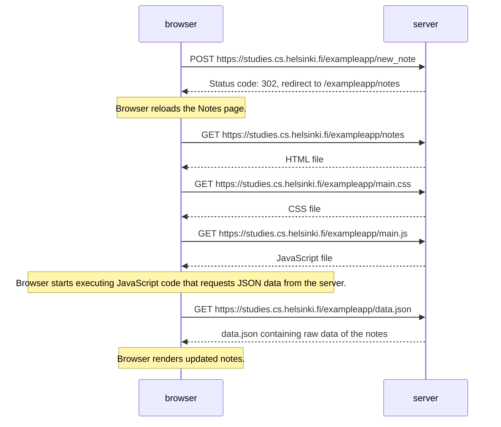

```mermaid
sequenceDiagram
    
    browser->>server: POST https://studies.cs.helsinki.fi/exampleapp/new_note
    server-->>browser: Status code: 302, redirect to /exampleapp/notes

    Note over browser: Browser reloads the Notes page.
    
    browser->>server: GET https://studies.cs.helsinki.fi/exampleapp/notes
    server-->>browser: HTML file
    
    browser->>server: GET https://studies.cs.helsinki.fi/exampleapp/main.css
    server-->>browser: CSS file

    browser->>server: GET https://studies.cs.helsinki.fi/exampleapp/main.js
    server-->>browser: JavaScript file
    
    Note over browser: Browser starts executing JavaScript code that requests JSON data from the server.
    
    browser->>server: GET https://studies.cs.helsinki.fi/exampleapp/data.json
    server-->>browser: data.json containing raw data of the notes

    Note over browser: Browser renders updated notes.
```
